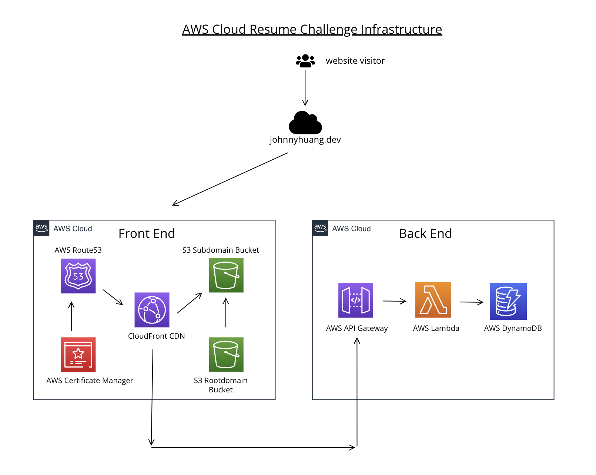

# Cloud Resume Challenge - Frontend Repository

Hello, welcome to the frontend repository for my Cloud Resume Challenge! This repository contains all files and configurations necessary to host and serve the frontend of my personal cloud resume website.

Check out my website: [www.johnnyhuang.dev](https://www.johnnyhuang.dev/) 

Check out the blog: https://leeward-fig-f44.notion.site/Johnny-s-CRC-Blog-11b96dded323802081bec3c41125e3c5

## Project Overview



This project is the frontend component of my Cloud Resume Challenge, hosted on AWS. The setup utilizes a variety of AWS services for the website's infrastructure. Below are the services that make up the frontend architecture:

- **Amazon S3**: 
  - Used to host static website files.
  - Two S3 buckets were created: one for the **root domain** (e.g., `johnnyhuang.dev`) and another for the **subdomain** (`www.johnnyhuang.dev`). The root domain bucket is configured to redirect requests to the subdomain, ensuring consistency and ease of access.

- **AWS Certificate Manager (ACM)**: 
  - Manages SSL/TLS certificates for the domain to enable HTTPS, providing secure connections for all frontend traffic.
  - The certificate is used by CloudFront and is validated using DNS records in Route 53.

- **Amazon CloudFront**:
  - Serves as the content delivery network (CDN) to improve performance by caching and distributing content globally.
  - Configured with an Origin Access Control (OAC) to securely connect to the S3 bucket for accessing the website’s content without making the S3 bucket publicly accessible.

- **Amazon Route 53**:
  - Manages DNS records for the domain and directs traffic to the CloudFront distribution.
  - Used to configure both the root domain and the `www` subdomain for seamless user access.

## Technologies Used

- **HTML & CSS**: For creating a responsive, user-friendly layout and styling of the resume page.
- **JavaScript**: For frontend interactivity, including a counter to display the number of visitors to the site.
- **AWS S3**: Used for hosting the static website, serving HTML, CSS, JavaScript, and image assets.
- **AWS CloudFront**: Set up as a CDN to improve website performance and provide HTTPS support.
- **Terraform**: For managing the infrastructure as code, including S3, CloudFront, and IAM policies.
- **GitHub Actions**: Configured to automate testing and deployment, ensuring seamless integration and delivery of updates.

## Features

- **Visitor Counter**: Integrated with a backend API to track and display the number of visitors in real-time.
- **Responsive Design**: Optimized for viewing on both desktop and mobile devices.
- **CDN and HTTPS**: CloudFront setup ensures faster content delivery and secure HTTPS access.

## File Structure

- `/website`: Contains the HTML, CSS, JavaScript, and images for the website.
  - `index.html`: The main HTML file.
  - `css/`: Folder containing stylesheets.
  - `js/`: Folder with JavaScript files, including the `visitor_counter.js` to fetch visitor count from the backend API.
  - `images/`: Folder for images and assets.
- `/terraform`: Contains all Terraform configuration files used to provision AWS infrastructure.
- `.github/workflows`: Contains GitHub Actions configuration for automated testing and deployment.
- `README.md`: Project documentation and overview.

## Setup and Deployment

1. **Clone the Repository**:
   ```bash
   git clone https://github.com/yourusername/cloud-resume-frontend.git
   cd cloud-resume-frontend

2. **Terraform Infrastructure Setup**
   ```bash
   cd terraform
   terraform init
   terraform apply
